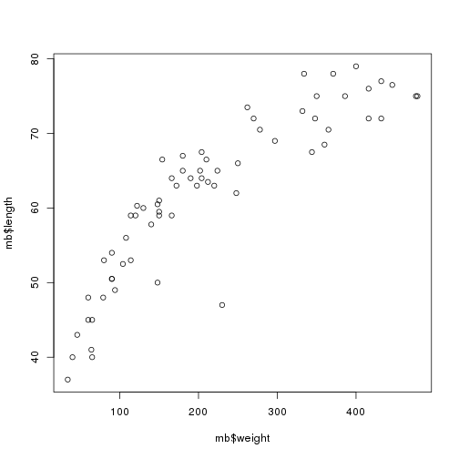
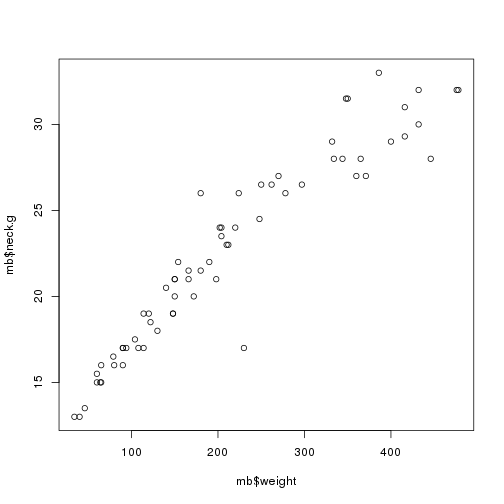
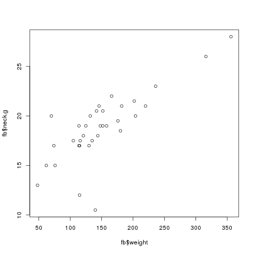
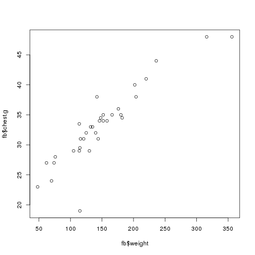
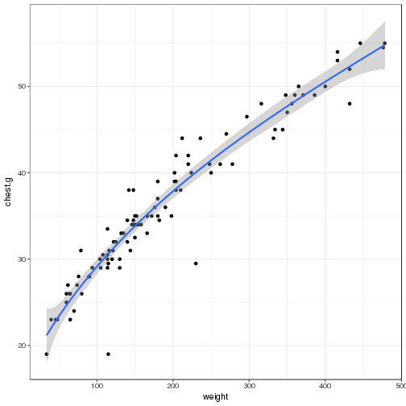

Bears
========================================================
author: 
date: 
autosize: true

Question
========================================================

Ranger Bob Berra needs help relocating bears out of Jellystone. He wants to move bears with higher weights but doesn't want to go and weight every bear. He asked to find a better way to determine the bears weight.

With this presentation I will demonstrate what I know and learned from the class
========================================================


```r
library(DT)
library(effects)
library(car)
library(readr)
library(ggplot2)
bears <- read_csv("/home/students/holmanma/Des_Models/Models/bears.csv")
mb <- subset(bears, sex=="male")
fb <- subset(bears, sex=="female")
```


========================================================

```r
summary(mb)
```

```
     sex                length          head.l          head.w     
 Length:66          Min.   :37.00   Min.   : 9.00   Min.   : 4.00  
 Class :character   1st Qu.:53.25   1st Qu.:12.00   1st Qu.: 5.50  
 Mode  :character   Median :63.25   Median :13.50   Median : 6.50  
                    Mean   :61.78   Mean   :13.55   Mean   : 6.55  
                    3rd Qu.:70.50   3rd Qu.:15.38   3rd Qu.: 7.50  
                    Max.   :79.00   Max.   :18.50   Max.   :10.00  
     neck.g         chest.g          weight     
 Min.   :13.00   Min.   :19.00   Min.   : 34.0  
 1st Qu.:17.12   1st Qu.:30.00   1st Qu.:114.0  
 Median :21.75   Median :36.50   Median :185.0  
 Mean   :22.50   Mean   :37.61   Mean   :213.0  
 3rd Qu.:27.00   3rd Qu.:44.88   3rd Qu.:323.2  
 Max.   :33.00   Max.   :55.00   Max.   :478.0  
```


========================================================

```r
summary(fb)
```

```
     sex                length          head.l          head.w     
 Length:34          Min.   :36.00   Min.   : 9.00   Min.   :4.500  
 Class :character   1st Qu.:57.00   1st Qu.:12.00   1st Qu.:5.000  
 Mode  :character   Median :59.25   Median :12.75   Median :6.000  
                    Mean   :58.01   Mean   :12.68   Mean   :5.794  
                    3rd Qu.:61.38   3rd Qu.:13.50   3rd Qu.:6.500  
                    Max.   :70.00   Max.   :15.50   Max.   :7.500  
     neck.g         chest.g          weight     
 Min.   :10.50   Min.   :19.00   Min.   : 48.0  
 1st Qu.:17.12   1st Qu.:29.12   1st Qu.:115.0  
 Median :19.00   Median :33.25   Median :141.0  
 Mean   :18.81   Mean   :33.24   Mean   :149.2  
 3rd Qu.:20.50   3rd Qu.:35.00   3rd Qu.:173.5  
 Max.   :28.00   Max.   :48.00   Max.   :356.0  
```


```r
mod1 <- lm(weight ~ length + head.l + head.w + neck.g + chest.g, data=bears)
fsex <- factor(bears$sex)
summary((mod1))
```

```

Call:
lm(formula = weight ~ length + head.l + head.w + neck.g + chest.g, 
    data = bears)

Residuals:
    Min      1Q  Median      3Q     Max 
-66.510 -15.556  -4.335  14.737 125.817 

Coefficients:
             Estimate Std. Error t value Pr(>|t|)    
(Intercept) -228.6650    25.9072  -8.826 5.75e-14 ***
length        -0.1788     0.8899  -0.201 0.841227    
head.l        -4.5112     3.8106  -1.184 0.239452    
head.w         1.0781     4.1568   0.259 0.795925    
neck.g         6.7175     1.9675   3.414 0.000946 ***
chest.g        9.4433     1.1806   7.998 3.22e-12 ***
---
Signif. codes:  0 '***' 0.001 '**' 0.01 '*' 0.05 '.' 0.1 ' ' 1

Residual standard error: 32.11 on 94 degrees of freedom
Multiple R-squared:  0.9219,	Adjusted R-squared:  0.9178 
F-statistic:   222 on 5 and 94 DF,  p-value: < 2.2e-16
```


```r
plot(mb$weight, mb$length)
```



========================================================


```r
plot(mb$weight, mb$neck.g)
```


========================================================

```r
plot(mb$weight, mb$chest.g)
```


========================================================


```r
plot(fb$weight, fb$neck.g)
```


========================================================

```r
plot(fb$weight, fb$chest.g)
```



========================================================


```r
mod1a <- lm(weight ~ length + I(length*chest.g) + I(length*neck.g) + I(length/chest.g), data=bears)
mod1b <- lm(weight ~ length + I(length*chest.g) + I(length*neck.g) + I(length/chest.g) + fsex, data=bears)

summary(mod1a)
```

```

Call:
lm(formula = weight ~ length + I(length * chest.g) + I(length * 
    neck.g) + I(length/chest.g), data = bears)

Residuals:
    Min      1Q  Median      3Q     Max 
-45.678 -13.021  -3.185   9.677 131.514 

Coefficients:
                    Estimate Std. Error t value Pr(>|t|)    
(Intercept)         65.20108   38.16138   1.709  0.09080 .  
length              -8.33142    1.31416  -6.340 7.71e-09 ***
I(length * chest.g)  0.18947    0.02281   8.308 6.73e-13 ***
I(length * neck.g)   0.05910    0.02116   2.793  0.00631 ** 
I(length/chest.g)   72.13814   31.39745   2.298  0.02378 *  
---
Signif. codes:  0 '***' 0.001 '**' 0.01 '*' 0.05 '.' 0.1 ' ' 1

Residual standard error: 24.58 on 95 degrees of freedom
Multiple R-squared:  0.9538,	Adjusted R-squared:  0.9518 
F-statistic:   490 on 4 and 95 DF,  p-value: < 2.2e-16
```

```r
summary(mod1b)
```

```

Call:
lm(formula = weight ~ length + I(length * chest.g) + I(length * 
    neck.g) + I(length/chest.g) + fsex, data = bears)

Residuals:
    Min      1Q  Median      3Q     Max 
-43.826 -13.115  -3.069   8.483 133.373 

Coefficients:
                    Estimate Std. Error t value Pr(>|t|)    
(Intercept)         73.10684   39.16528   1.867   0.0651 .  
length              -8.49036    1.32680  -6.399 6.06e-09 ***
I(length * chest.g)  0.18778    0.02290   8.199 1.22e-12 ***
I(length * neck.g)   0.06609    0.02252   2.935   0.0042 ** 
I(length/chest.g)   71.98619   31.42557   2.291   0.0242 *  
fsexmale            -5.28296    5.78940  -0.913   0.3638    
---
Signif. codes:  0 '***' 0.001 '**' 0.01 '*' 0.05 '.' 0.1 ' ' 1

Residual standard error: 24.6 on 94 degrees of freedom
Multiple R-squared:  0.9542,	Adjusted R-squared:  0.9517 
F-statistic: 391.4 on 5 and 94 DF,  p-value: < 2.2e-16
```
=======================================================

```
[1] "sex"     "length"  "head.l"  "head.w"  "neck.g"  "chest.g" "weight" 
```

```

Call:
lm(formula = weight ~ ., data = bears)

Residuals:
    Min      1Q  Median      3Q     Max 
-66.995 -15.474  -4.438  13.812 126.953 

Coefficients:
             Estimate Std. Error t value Pr(>|t|)    
(Intercept) -229.6235    26.3046  -8.729 9.95e-14 ***
sexmale        1.9170     7.4868   0.256  0.79847    
length        -0.1487     0.9020  -0.165  0.86937    
head.l        -4.5087     3.8297  -1.177  0.24208    
head.w         1.0700     4.1777   0.256  0.79842    
neck.g         6.5523     2.0799   3.150  0.00219 ** 
chest.g        9.4822     1.1962   7.927 4.82e-12 ***
---
Signif. codes:  0 '***' 0.001 '**' 0.01 '*' 0.05 '.' 0.1 ' ' 1

Residual standard error: 32.27 on 93 degrees of freedom
Multiple R-squared:  0.922,	Adjusted R-squared:  0.917 
F-statistic: 183.2 on 6 and 93 DF,  p-value: < 2.2e-16
```

```

Call:
lm(formula = weight ~ ., data = bears)

Coefficients:
(Intercept)      sexmale       length       head.l       head.w  
  -229.6235       1.9170      -0.1487      -4.5087       1.0700  
     neck.g      chest.g  
     6.5523       9.4822  
```

========================================================

```r
ggplot(data = bears, aes(x = weight, y =  neck.g )) + 
  geom_point() + 
  theme_bw() + 
  stat_smooth(method = "lm", formula = y ~ poly(sqrt(x), 1))
```


========================================================


```r
ggplot(data = bears, aes(x = weight, y = chest.g  )) + 
  geom_point() + 
  theme_bw() + 
  stat_smooth(method = "lm", formula = y ~ poly(sqrt(x), 4)) 
```




========================================================


```
Error in parse(text = x, srcfile = src) : 
  <text>:5:0: unexpected end of input
3:   theme_bw() + 
4:   stat_smooth(method = "lm", formula = y ~ poly(x, 1))+
  ^
```
