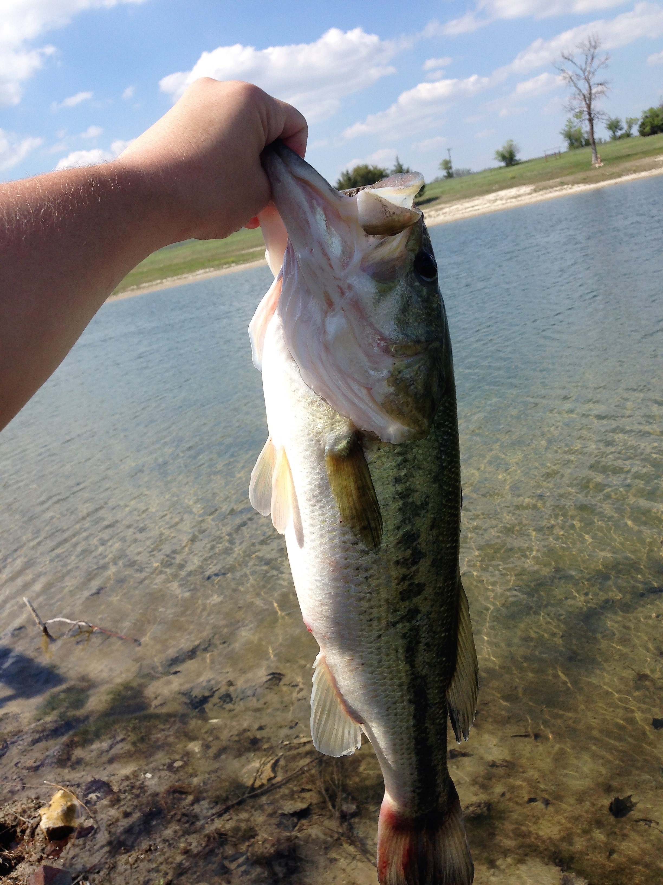
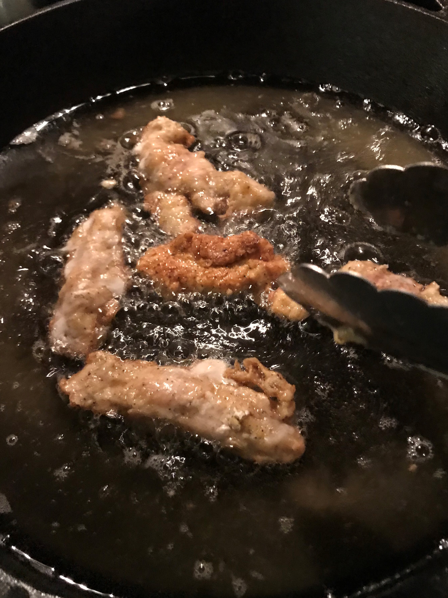

---
output:
  html_document:
    theme: yeti
---

```{r setup, include=FALSE}
knitr::opts_chunk$set(echo = TRUE)
```
Baseaball

```{r, echo=FALSE}
library(knitr)
knitr::include_graphics("./img/base.jpg")
```

Fishing 
```{r, echo=FALSE}

```

Cooking
```{r, echo=FALSE}



```


