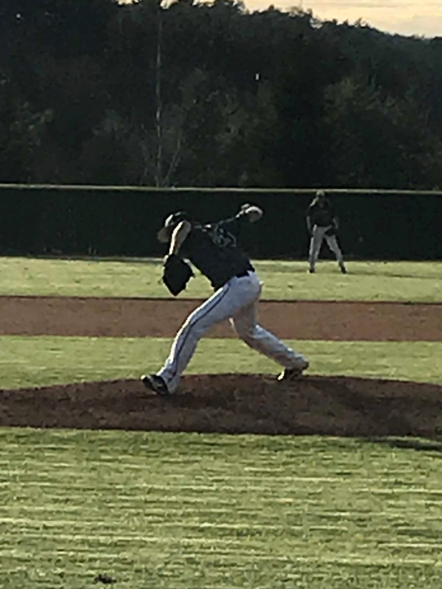

```{r setup, include=FALSE}
knitr::opts_chunk$set(echo = TRUE)
```

```{r echo=FALSE}
library(knitr)

```

I am a senior at Appalachian State University studying statistics. I am a relief pitcher for the Club Baseball team. I throw submarine and my fastball hits 80 mph. I also throw many pitches including a slider and a Knuckllball
