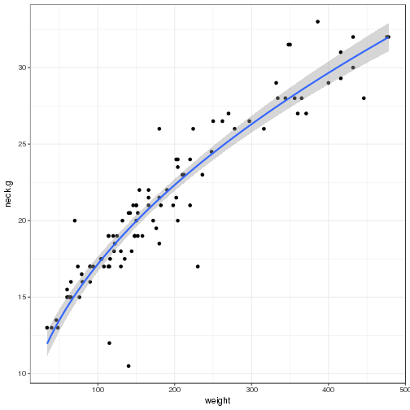
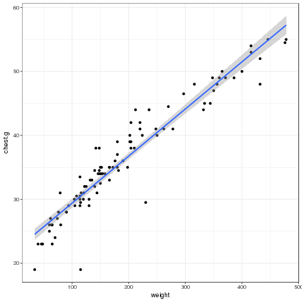

Bears
========================================================
author: 
date: 
autosize: true

Question
========================================================

Ranger Bob Berra needs help relocating bears out of Jellystone. He wants to move bears with higher weights but doesn't want to go and weight every bear. He asked to find a better way to determine the bears weight.

With this presentation I will demonstrate what I know and learned from the class


========================================================


```r
library(DT)
library(effects)
library(car)
library(readr)
library(ggplot2)
library(tidyverse)
bears <- read_csv("/home/students/holmanma/Des_Models/Models/bears.csv")
mb <- subset(bears, sex=="male")
fb <- subset(bears, sex=="female")

bears %>%
  group_by(sex)%>%
  summarise(mean (chest.g), mean(neck.g))
```

```
# A tibble: 2 x 3
     sex `mean(chest.g)` `mean(neck.g)`
   <chr>           <dbl>          <dbl>
1 female        33.23529       18.80882
2   male        37.60606       22.49697
```


========================================================


```r
summary(mb)
```

```
     sex                length          head.l          head.w     
 Length:66          Min.   :37.00   Min.   : 9.00   Min.   : 4.00  
 Class :character   1st Qu.:53.25   1st Qu.:12.00   1st Qu.: 5.50  
 Mode  :character   Median :63.25   Median :13.50   Median : 6.50  
                    Mean   :61.78   Mean   :13.55   Mean   : 6.55  
                    3rd Qu.:70.50   3rd Qu.:15.38   3rd Qu.: 7.50  
                    Max.   :79.00   Max.   :18.50   Max.   :10.00  
     neck.g         chest.g          weight     
 Min.   :13.00   Min.   :19.00   Min.   : 34.0  
 1st Qu.:17.12   1st Qu.:30.00   1st Qu.:114.0  
 Median :21.75   Median :36.50   Median :185.0  
 Mean   :22.50   Mean   :37.61   Mean   :213.0  
 3rd Qu.:27.00   3rd Qu.:44.88   3rd Qu.:323.2  
 Max.   :33.00   Max.   :55.00   Max.   :478.0  
```


========================================================


```r
summary(fb)
```

```
     sex                length          head.l          head.w     
 Length:34          Min.   :36.00   Min.   : 9.00   Min.   :4.500  
 Class :character   1st Qu.:57.00   1st Qu.:12.00   1st Qu.:5.000  
 Mode  :character   Median :59.25   Median :12.75   Median :6.000  
                    Mean   :58.01   Mean   :12.68   Mean   :5.794  
                    3rd Qu.:61.38   3rd Qu.:13.50   3rd Qu.:6.500  
                    Max.   :70.00   Max.   :15.50   Max.   :7.500  
     neck.g         chest.g          weight     
 Min.   :10.50   Min.   :19.00   Min.   : 48.0  
 1st Qu.:17.12   1st Qu.:29.12   1st Qu.:115.0  
 Median :19.00   Median :33.25   Median :141.0  
 Mean   :18.81   Mean   :33.24   Mean   :149.2  
 3rd Qu.:20.50   3rd Qu.:35.00   3rd Qu.:173.5  
 Max.   :28.00   Max.   :48.00   Max.   :356.0  
```

========================================================


```
[1] "sex"     "length"  "head.l"  "head.w"  "neck.g"  "chest.g" "weight" 
```

```

Call:
lm(formula = weight ~ ., data = bears)

Residuals:
    Min      1Q  Median      3Q     Max 
-66.995 -15.474  -4.438  13.812 126.953 

Coefficients:
             Estimate Std. Error t value Pr(>|t|)    
(Intercept) -229.6235    26.3046  -8.729 9.95e-14 ***
sexmale        1.9170     7.4868   0.256  0.79847    
length        -0.1487     0.9020  -0.165  0.86937    
head.l        -4.5087     3.8297  -1.177  0.24208    
head.w         1.0700     4.1777   0.256  0.79842    
neck.g         6.5523     2.0799   3.150  0.00219 ** 
chest.g        9.4822     1.1962   7.927 4.82e-12 ***
---
Signif. codes:  0 '***' 0.001 '**' 0.01 '*' 0.05 '.' 0.1 ' ' 1

Residual standard error: 32.27 on 93 degrees of freedom
Multiple R-squared:  0.922,	Adjusted R-squared:  0.917 
F-statistic: 183.2 on 6 and 93 DF,  p-value: < 2.2e-16
```

```

Call:
lm(formula = weight ~ ., data = bears)

Coefficients:
(Intercept)      sexmale       length       head.l       head.w  
  -229.6235       1.9170      -0.1487      -4.5087       1.0700  
     neck.g      chest.g  
     6.5523       9.4822  
```


========================================================


```r
ggplot(data = bears, aes(x = weight, y =  neck.g )) + 
  geom_point() + 
  theme_bw() + 
  stat_smooth(method = "lm", formula = y ~ poly(sqrt(x), 1))
```



========================================================


```r
ggplot(data = bears, aes(x = weight, y = chest.g  )) + 
  geom_point() + 
  theme_bw() + 
  stat_smooth(method = "lm", formula = y ~ poly(sqrt(x), 4)) 
```


========================================================


```r
ggplot(data = bears, aes(x = weight, y =  chest.g )) + 
  geom_point() + 
  theme_bw() + 
  stat_smooth(method = "lm", formula = y ~ poly(x, 1))
```




What I have learned
========================================================

I can make a website using R studio and git hub.

First

open and create a text file save it _site.yml

Second 

name the site from your project

 name: "Mitchell-Holman.github.io"
output_dir: "."

========================================================


Third 

create navbar
navbar:

  title: "Mitchell Holman"
  left:
  - text: "Bike Project"
    href: Projects.html
  - text: "Hobbies"
    href: hobs.html
  - text: "Time Series"
    href: Time.html
  right:
  - icon: fa-github fa-lg
    href: https://github.com/Mitchell-Holman/Mitchell-Holman.github.io
output:
  html_document:
    theme: yeti
    
now build your site

========================================================
